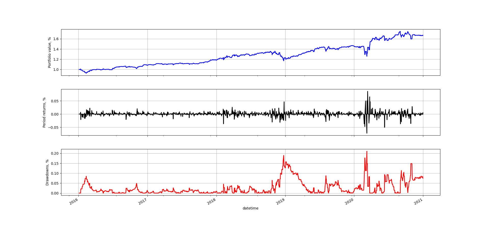

# Modified-QuantStart-Backtester-With-Trading-Strategies

This repository consists of an event-driven backtester, based on a series of articles written by <strong>Michael Halls-Moore</strong>:

1. [Event-Driven Backtesting with Python - Part I](http://www.quantstart.com/articles/Event-Driven-Backtesting-with-Python-Part-I)
2. [Event-Driven Backtesting with Python - Part II](http://www.quantstart.com/articles/Event-Driven-Backtesting-with-Python-Part-II)
3. [Event-Driven Backtesting with Python - Part III](http://www.quantstart.com/articles/Event-Driven-Backtesting-with-Python-Part-III)
4. [Event-Driven Backtesting with Python - Part IV](http://www.quantstart.com/articles/Event-Driven-Backtesting-with-Python-Part-IV)
5. [Event-Driven Backtesting with Python - Part V](http://www.quantstart.com/articles/Event-Driven-Backtesting-with-Python-Part-V)
6. [Event-Driven Backtesting with Python - Part VI](http://www.quantstart.com/articles/Event-Driven-Backtesting-with-Python-Part-VI)
7. [Event-Driven Backtesting with Python - Part VII](http://www.quantstart.com/articles/Event-Driven-Backtesting-with-Python-Part-VII)


<p align="justify">The code has been rewritten by hand, modified and improved for most parts. Indeed, copying and pasting the different parts of the code won't make the code run. The author gave the direction on how to implement a backtester, but some additional work was necessary to make the code function properly. 
  
<p align="justify">Some additions have also been added in terms of data handling and strategies implemented:</p>

<ul>
  <li><div align="justify"><code>YahooDataHandler</code> that allows to get data directly from Yahoo Finance website and update the latest "bar" in a live manner.</div></li>
  <li><div align="justify"><code>HistoricMySQLDataHandler</code> designed to read a MySQL database for each requested symbol from disk, and provides an interface to obtain the "latest" bar in a manner identical to a live trading interface.</div></li>
  <li><div align="justify"><code>MovingAverageCrossOverStrat</code> to carry out a basic Moving Average Crossover strategy with a
    short/long simple weighted moving average.</div></li>
  <li><div align="justify"><code>ETFDailyForecastStrategy</code> to carry out a forecast prediction of the price of an ETF on next day, and enter/exit trades based on that prediction.</div></li>
</ul>


  
## Getting Started

<p align="justify">These instructions will get you a copy of the project up and running on your local machine for development and testing purposes. See deployment for notes on how to deploy the project on a live system.</p>

### Prerequisites

<p align="justify">You need <strong>Python 3.x</strong> to run the following code.  You can have multiple Python versions (2.x and 3.x) installed on the same system without problems. Python needs to be first installed then <strong>SciPy</strong> and <strong>pymysql</strong> as there are dependencies on packages.</p>

In Ubuntu, Mint and Debian you can install Python 3 like this:

    sudo apt-get install python3 python3-pip

Alongside Python, the SciPy packages are also required. In Ubuntu and Debian, the SciPy ecosystem can be installed by:

    sudo apt-get install python-numpy python-scipy python-matplotlib ipython ipython-notebook python-pandas python-sympy python-nose
    
The latest release of Scikit-Learn machine learning package, which can be installed with pip:
    
    pip install -U scikit-learn

Finally, the pymysql package for connecting to MySQL databases using Python, which can be installed with pip:
    
    pip install pymysql

For other Linux flavors, OS X and Windows, packages are available at:

http://www.python.org/getit/  
https://www.scipy.org/install.html
https://scikit-learn.org/stable/install.html


### File descriptions
<ul>
  
<li><div align="justify">'<em>BacktesterLoop.py</em>' in which the Backtest class hierarchy encapsulates the other classes, to carry out a nested while-loop event-driven system in order to handle the events placed on the Event Queue object.</div></li>
    
<li><div align="justify">'<em>DataHandler.py</em>' which defines a class that gives all subclasses an interface for providing market data to the remaining components within the system. Data can be obtained directly from the web, a database or be read from CSV files for instance.</div></li>

<li><div align="justify">'<em>Events.py</em>' with four types of events (market, signal, order and fill), which allow communication between the above components via an event queue, are implemented.</div></li>

<li><div align="justify">'<em>Execution.py</em>' to simulate the order handling mechanism and ultimately tie into a brokerage or other
means of market connectivity.</div</li>

<li><div align="justify">'<em>Main.py</em>' which is the main Python program, englobing all the different subroutines, and where the different parameters to initialize the backtesting simulations are specified.</div</li>

<li><div align="justify">'<em>Performance.py</em>' in which performance assessment criteria are implemented such as the Sharpe ratio and drawdowns.</div</li>
  
<li><div align="justify">'<em>PlotPerformance.py</em>' to plot figures based on the equity curve obtained after backtesting.</div</li>
  
<li><div align="justify">'<em>Portfolio.py</em>' that keeps track of the positions within a portfolio, and generates orders of a fixed quantity of stock based on signals.</div></li>

<li><div align="justify">'<em>Strategy.py</em>' to generate a signal event from a particular strategy to communicate to the portfolio.</div></li>

<li><div align="justify">In the '<em>Strategies</em>' directory, different trading strategies are implemented to be used for backtesting:</div></li>

  <ul>
    <li><div align="justify">'<em>Buy_And_Hold_Strat.py</em>' in which a simple buy and hold strategy is coded.</div></li>
  <li><div align="justify">'<em>MAC_Strat.py</em>' to generate signals from simple moving averages.</div></li>
  <li><div align="justify">'<em>CreateLaggedSeries.py</em>' to create lagged timeseries, to be used in the ETF forecast strategy (helper function).</div></li>
  <li><div align="justify">'<em>ETF_Forecast.py</em>' to generate signals on the current from previous days prices of an ETF.</div></li>
  </ul>

  


</ul>

### Running the program

The different "<em>.py</em>" files need to be placed in the same folder for the main script to be run. The code is then ready to be used, and just requires running the following command:

    python Main.py

<p align="justify">The code is well commented and easy to understand. The different parameters calculated and used for the simulations are:</p>

``` python
if __name__ == "__main__":
    data_dir = Path.cwd() / 'DataDir'  # For reading from CSV files
    symbol_list = ['^OEX']
    initial_capital = 100000.0
    start_date = datetime(2016, 1, 1, 0, 0, 0)
    end_date = datetime(2021, 1, 1, 0, 0, 0)
    interval = '1d'
    heartbeat = 0.0  # necessary for live feed

    backtest = Backtest(data_dir,  # data directory of CSV files
                        symbol_list,  # list of symbols
                        initial_capital,  # initial capital available for trading
                        heartbeat,  # heartbeat to count time in real live trading simulation
                        start_date,  # starting time of the trading
                        end_date,  # ending time of the trading
                        interval,  # interval of the data
                        YahooDataHandler,  # data management method
                        SimpleSimulatedExecutionHandler,  # Type of execution in relationship to broker
                        Portfolio,  # portfolio management method
                        ETFDailyForecastStrategy)  # strategy chosen

    backtest.simulate_trading()
```

<p align="justify">Running the backtester will generate a CSV file "<em>equity.csv</em>", with PnL curve, returns, drawdowns, etc. By running the following Python script, a plot can be generated to assess the strategy:</p>

    python PlotPerformance.py

<p align="justify">The picture below shows an example with the parameters highlighted above.</p>




## Contributing

Please read [CONTRIBUTING.md](https://github.com/DavidCico/Modified-QuantStart-Backtester-With-Trading-Strategies/blob/master/CONTRIBUTING.md) for details on our code of conduct, and the process for submitting pull requests to us.

## Versioning

We use [SemVer](http://semver.org/) for versioning. For the versions available, see the [tags on this repository](https://github.com/your/project/tags). 

## Authors

* **David Cicoria** - *Initial work* - [DavidCico](https://github.com/DavidCico)

See also the list of [contributors](https://github.com/DavidCico/Modified-QuantStart-Backtester-With-Trading-Strategies/graphs/contributors) who participated in this project.
